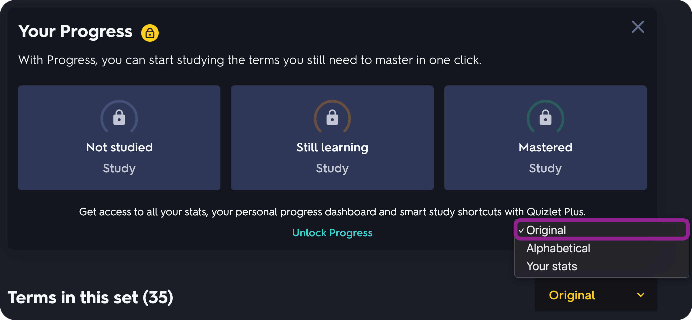
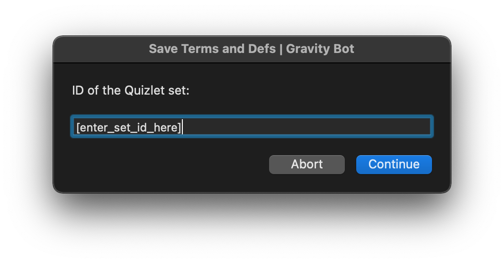
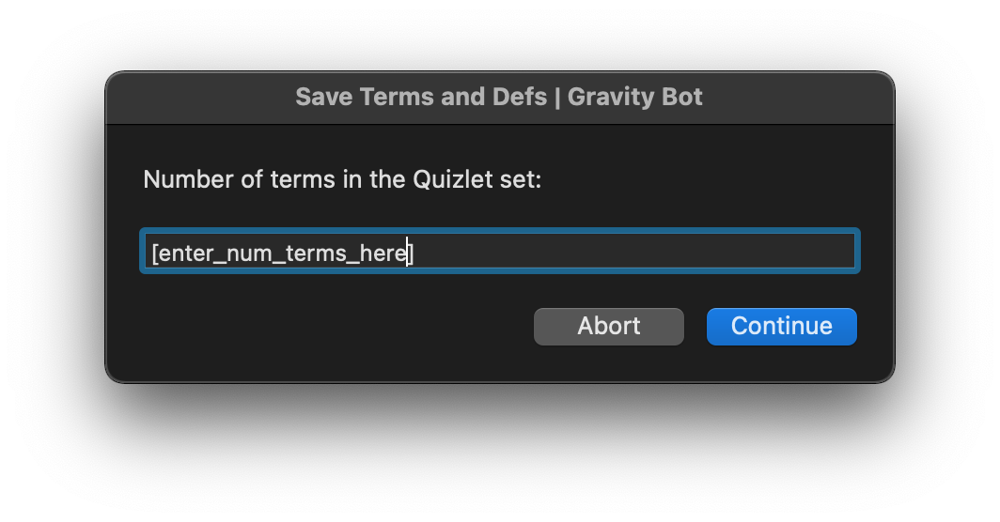
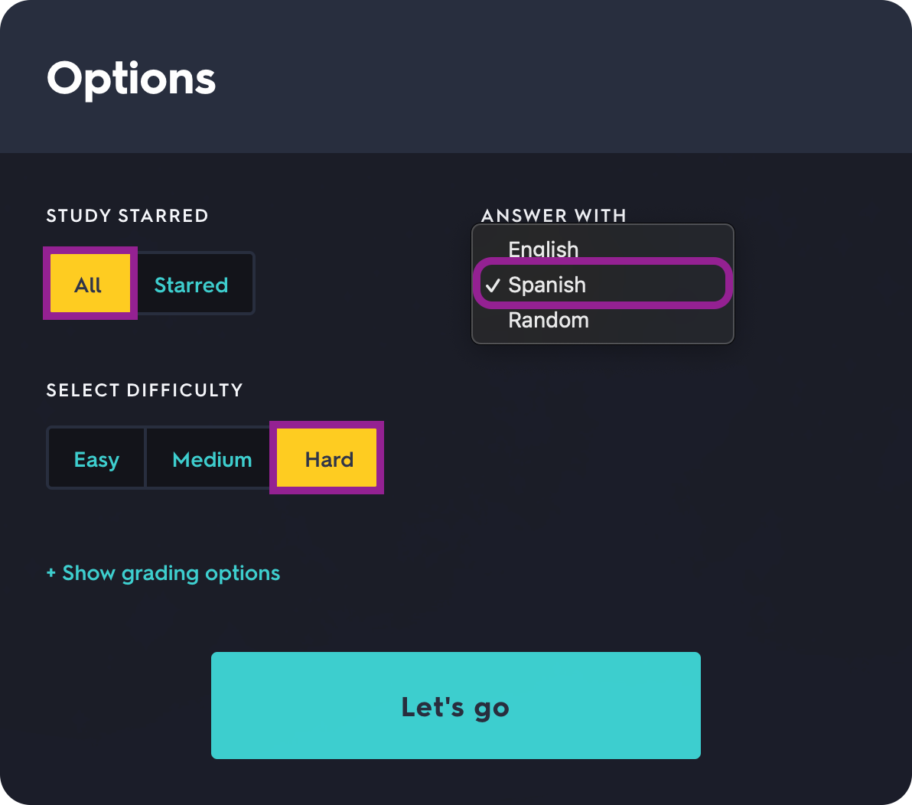

# Quizlet-Grav-Bot
A Gravity bot for Macs.
 
## Usage:
**1.** Open the home page of a Quizlet set in Chrome

**2.** Next to "Terms in this set", select "Original"

**3.** With the Quizlet tab frontmost, run the applescript file using ` osascript "[path_to_file]"` in a bash terminal or by opening and running it in Script Editor

**4.** Enter the ID of the set (this is the 9 digit number in the URL)

**5.** Enter the number of terms in the set

**6.** The Gravity game will open automatically. Select the options to use all the terms and to answer with the terms that were in the right-hand column on the homepage. Then select difficulty level "Hard" for maximum points.

**7.** Start the game! Your computer will automatically enter and submit the definitions while the Gravity tab is frontmost.
