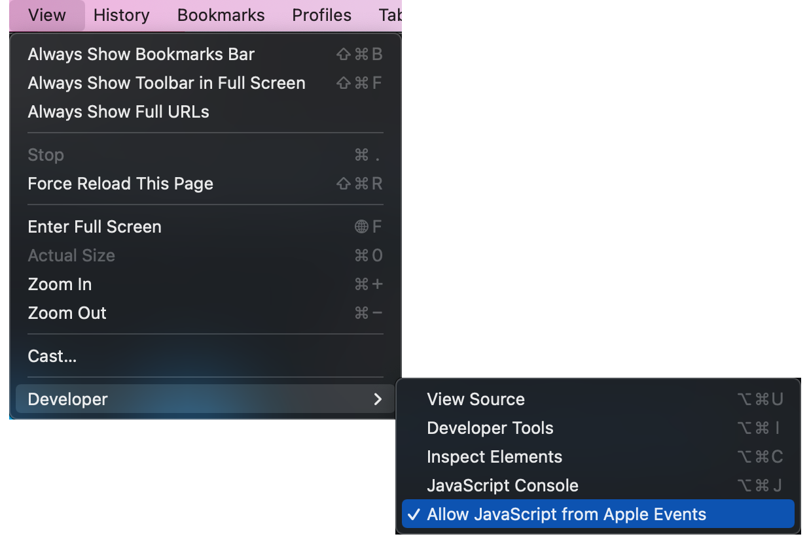

# Quizlet-Grav-Bot
A Gravity bot for Macs.
This is an unmaintained prototype.

## Usage:
**1.**
Open the home page of a Quizlet set in Chrome

**2.**
From Chrome's menu bar, ensure that "Allow JavaScript from Apple Events" is checked.

**3**.
Next to "Terms in this set", select "Original". Next, scroll all the way down to ensure that the browser renders all of the terms on the page.

**4.**
With the Quizlet tab frontmost, run the applescript file using `osascript "[path-to/Quizlet-Grav-Bot.applescript]"` in a bash terminal, or by opening the file and clicking the run button in the Script Editor app.

**5.**
Enter the ID of the set (this is the 9 digit number in the URL)

**6.**
Enter the number of terms in the set

**7.**
The Gravity game will open automatically. Select the options to use all the terms and to answer with the terms that were in the right-hand column on the homepage. If you encounter any issues, try selecting the other option. Then select difficulty level "Hard" for maximum points.

**8.**
Start the game! Your computer will automatically enter and submit the definitions while the tab running Gravity is frontmost.

